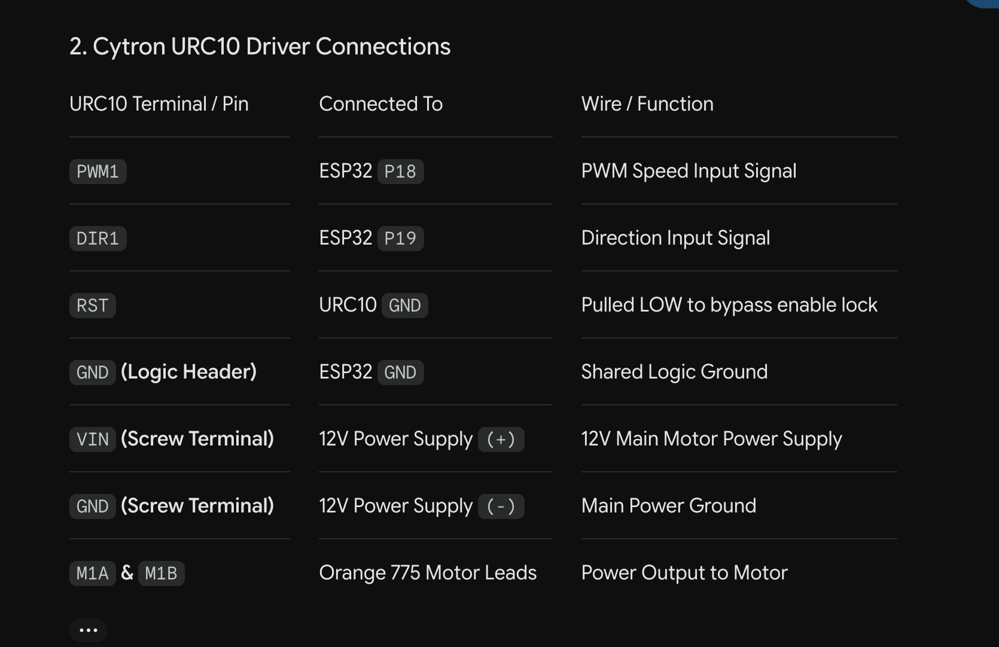

# Motor Encoder with Feedback
This repository contains the setup, hardware wiring, and Arduino C++ code to drive a planetary gear DC motor using an ESP32 Dev Module and a Cytron URC10 Motor Driver.

---

##  Components

* **Microcontroller**: ESP32 Dev Module
* **Motor Driver**: Cytron URC10 Dual-Channel DC Motor Driver
* **Motor**: Orange 775 DC Motor with Quadrature Encoder
* **Power Supply**: 12V DC External Power Supply (Connected to URC10)
* **IDE**: Arduino IDE with ESP32 Board Package (v3.0.0+)

---

##  Arduino IDE Configuration

Before uploading the sketch, configure your IDE with the following settings:

* **Board**: `"ESP32 Dev Module"`
* **Port**: Select your serial port (e.g., `/dev/cu.usbserial-0001` on macOS or `COMx` on Windows)
* **Baud Rate**: `115200` 

---

##  Hardware Wiring Diagram
Find the attached wiring schematic below. 

## Firmware Code
Can be found in [`encoder_readings.ino`](encoder_readings.ino).
